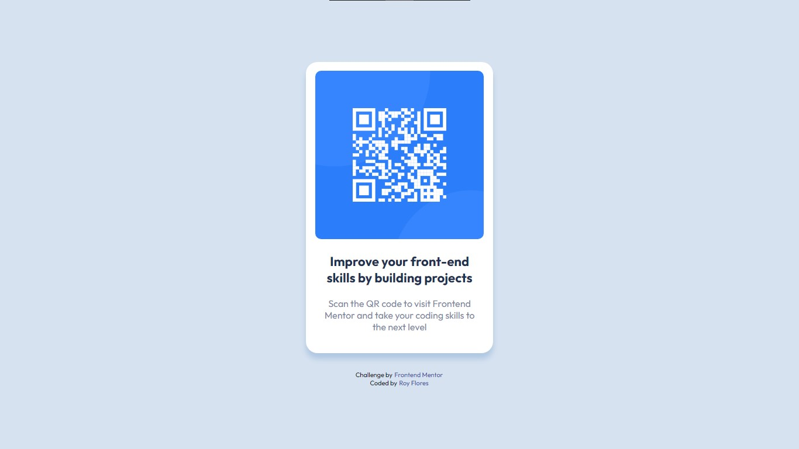

# Frontend Mentor - QR code component solution

This is a solution to the [QR code component challenge on Frontend Mentor](https://www.frontendmentor.io/challenges/qr-code-component-iux_sIO_H). Frontend Mentor challenges help you improve your coding skills by building realistic projects. 

## Table of contents

- [Overview](#overview)
  - [Screenshot](#screenshot)
  - [Links](#links)
- [My process](#my-process)
  - [Built with](#built-with)
  - [What I learned](#what-i-learned)
  - [Continued development](#continued-development)
  - [Useful resources](#useful-resources)
- [Author](#author)
- [Acknowledgments](#acknowledgments)

## Overview

This is my attempt at recreating the QR code component.

### Screenshot

### Links

- Solution URL: [GitHub](https://github.com/mr-roycflores/frontend-mentor-qr-code-component-solution)
- Live Site URL: [GitHub Pages](https://mr-roycflores.github.io/frontend-mentor-qr-code-component-solution/)

## My process

I started with the outermost elements and worked my way in as I began to refine the smaller details, tweaking the values as I saw fit.

### Built with

- Semantic HTML5 markup
- CSS custom properties
- Flexbox
- Mobile-first workflow

### What I learned

I found a method to get as close as possible to the referrence image by using Alt-Tab to compare the image over my output and see exactly where I need to make adjustments.

### Continued development

I had some trouble figuring out the exact spacing between the text and the border of the card. I will continue refine my CSS skills through regular practice and research.

### Useful resources

- [W3Schools](https://www.w3schools.com) - This website has been very usefull for me.

## Author

- Frontend Mentor - [@mr-roycflores](https://www.frontendmentor.io/profile/mr-roycflores)
- Twitter - [@mr_roycflores](https://twitter.com/mr_roycflores)

## Acknowledgments

This is a resubmission from an old account that I recently deleted because I was using a personal GitHub on the old account.